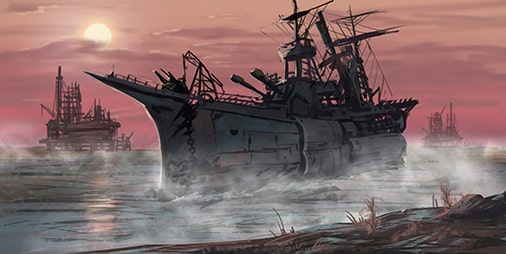

# game-battleship

Classic game of battleship adapted for the web. Users can choose to play either against the computer (single player mode) or against another user (multi player mode). The app is currently deployed on heroku at [https://game-battleship.herokuapp.com/](https://game-battleship.herokuapp.com/).

We initially adapted this app from the fun and educational videos of YouTubers [Ania Kubow](https://youtu.be/U64vIhh0TyM), [codeSTACKr](https://youtu.be/TpAwggQJPUQ), and [Web Dev Simplified](https://youtu.be/G6JTM-zt-dQ) and are currently upgrading it with the following features:
- users can "re"position their ships before starting a game
- for the single player mode, the computer is programmed with a strategy to fire instead of random firing
- for the multi player mode, users have chat area where they can engage with each other
- for the multi player mode, users can set their own game time limit (no more than 30 minutes) instead of the default 15 minutes
- the app is made mobile friendly

## Technologies:

HTML, CSS, JavaScript, Node.js, Express.js, socket.io

## Installation

To install the dependencies, type `  npm i ` at the command line.

## Credits

- Ania Kubow, [https://www.youtube.com/channel/UC5DNytAJ6_FISueUfzZCVsw](https://www.youtube.com/channel/UC5DNytAJ6_FISueUfzZCVsw)
- codeSTACKr, [https://www.youtube.com/codeSTACKr](https://www.youtube.com/codeSTACKr)
- Web Dev Simplified, [https://www.youtube.com/channel/UCFbNIlppjAuEX4znoulh0Cw](https://www.youtube.com/channel/UCFbNIlppjAuEX4znoulh0Cw)
